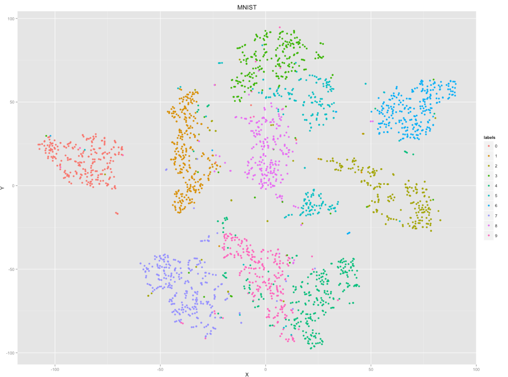

[](https://travis-ci.org/lejon/TSne.jl)
[](https://coveralls.io/github/lejon/TSne.jl?branch=master)

Julia t-SNE
===========

Julia port of L.J.P. van der Maaten and G.E. Hintons T-SNE visualisation technique.

Please observe, that it is not extensively tested. 

The examples in the 'examples' dir requires you to have Gadfly and RDatasets installed

**Please note:** At some point something changed in Julia which caused poor results, it took a while before I noted this but now  I have updated the implementation so that it works again. See the link below for images rendered using this implementation.

For some tips working with t-sne [Klick here] (http://lejon.github.io)

## Basic installation: 

  `julia> Pkg.clone("git://github.com/lejon/TSne.jl.git")`
  
## Basic API usage: 
  
```jl
using TSne, MNIST

function normalize(A)
	for col in 1:size(A)[2]
        	std(A[:,col]) == 0 && continue 
        	A[:,col] = (A[:,col]-mean(A[:,col])) / std(A[:,col])
	end
	A
end

data, labels = traindata()
data = data'
data = data[1:2500,:]
# Normalize the data, this should be done if there are large scale differences in the dataset
X = normalize(float(data)) 

Y = tsne(X, 2, 50, 1000, 20.0)

using Gadfly
labels = [string(i) for i in labels[1:2500]]
theplot = plot(x=Y[:,1], y=Y[:,2], color=labels)
draw(PDF("myplot.pdf", 4inch, 3inch), theplot)
```



## Stand Alone Usage

```julia demo-csv.jl haveheader --labelcol=5 iris-headers.csv```

Creates myplot.pdf with TSne result visuallized using Gadfly.
